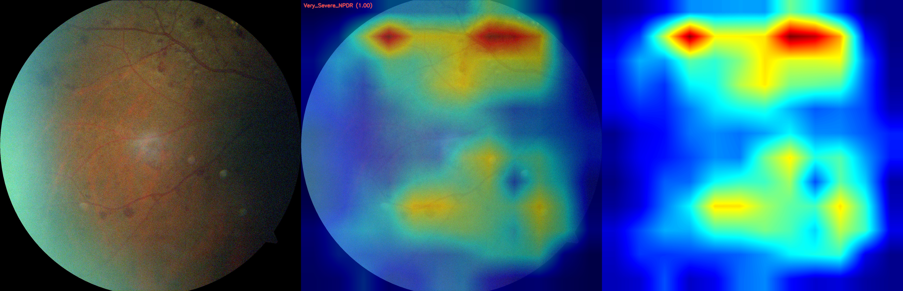

# **Eye-XAI: Explainable Diabetic Retinopathy Classification using MobileNetV3**

Eye-XAI is a lightweight, explainable deep-learning system for **Diabetic Retinopathy (DR) classification** using **MobileNetV3**.
The model predicts **7 DR severity levels** and provides **Grad-CAM heatmaps** that highlight clinically relevant retinal regions used during prediction, improving transparency and trust in AI-assisted medical screening.

---

## ⭐ **Key Features**

* **MobileNetV3-Small** model for fast and deployable DR classification
* **7-class severity prediction** (No DR → Advanced PDR)
* **CLAHE preprocessing** for enhanced retinal visibility
* **Data augmentation + class balancing**
* **Fine-tuning pipelines (V1, V2, V3)** to improve accuracy
* **Grad-CAM explainability** for lesion localization
* **Training curves + sample outputs included**
* Clean and modular project structure (`src/`)

---

## 📂 **Project Structure**

```
eye-xai/
 ┣ src/
 │   ┣ fine_tune.py             # Baseline fine-tuning
 │   ┣ fine_tune_v2.py          # CLAHE + augmentation pipeline
 │   ┣ fine_tune_v3.py          # Best performing pipeline (Focal Loss, TTA)
 │   ┣ grad_cam.py              # Grad-CAM visualization
 │   ┣ main.py                  # Inference pipeline
 │   ┗ split_data.py            # Train/Val/Test dataset splitter
 ┣ outputs/
 │   ┣ gradcam_result.jpg
 │   ┣ gradcam_side_by_side.jpg
 │   ┗ training_curve_v3.png
 ┣ requirements.txt
 ┣ README.md
```

---

## 📥 **Dataset**

This project uses the official **"Dataset from Fundus Images for the Study of Diabetic Retinopathy – Version V03"**.


[https://zenodo.org/records/4647952](https://zenodo.org/records/4647952)


This dataset contains 7 DR classes:

1. No DR
2. Mild NPDR
3. Moderate NPDR
4. Severe NPDR
5. Very Severe NPDR
6. Proliferative DR
7. Advanced PDR

### 📁 **Dataset Folder Structure**

```
dataset/
 ┣ 0_No_DR/
 ┣ 1_Mild/
 ┣ 2_Moderate/
 ┣ 3_Severe/
 ┣ 4_Very_Severe/
 ┣ 5_Proliferative/
 ┗ 6_Advanced_PDR/
```

---

## 🔧 **Installation**

### **1. Clone the repository**

```bash
git clone https://github.com/deekshhh37/eye-xai.git
cd eye-xai
```

### **2. Create and activate virtual environment**

Windows:

```bash
python -m venv venv
venv\Scripts\activate
```

Mac/Linux:

```bash
python3 -m venv venv
source venv/bin/activate
```

### **3. Install dependencies**

```bash
pip install -r requirements.txt
```

---

## 🛠️ **Prepare Train/Val/Test Split**

Run:

```bash
python src/split_data.py
```

This will generate:

```
data_split/
 ┣ train/
 ┣ val/
 ┗ test/
```

> ⚠️ This folder is ignored by GitHub to prevent uploading large datasets.

---

## 🏋️‍♂️ **Training the Model**

### **Baseline Fine-Tuning**

```bash
python src/fine_tune.py
```

### **Fine-Tuning V2: CLAHE + Strong Augmentation**

```bash
python src/fine_tune_v2.py
```

### **Fine-Tuning V3: Focal Loss + LR Scheduling + TTA (Best Version)**

```bash
python src/fine_tune_v3.py
```

Model checkpoints are saved inside:

```
outputs/model_checkpoints/
```

(ignored in git)

---

## 🔍 **Inference**

Run prediction on a single fundus image:

```bash
python src/main.py --image path/to/image.jpg --model outputs/model_checkpoints/best.pt
```

---

## 🔥 **Explainability with Grad-CAM**

Generate heatmaps:

```bash
python src/grad_cam.py --image path/to/image.jpg
```

Sample outputs (included in repo):

* `outputs/gradcam_result.jpg`
* `outputs/gradcam_side_by_side.jpg`

---

## 📈 **Results**

### **Grad-CAM Example**



---

## 🧠 **Model Architecture Overview**

* **Backbone:** MobileNetV3-Small
* **Preprocessing:** CLAHE, normalization
* **Augmentation:** Random rotations, flips, color jitter
* **Loss Functions:** CrossEntropy, Focal Loss
* **Optimizer:** Adam / SGD
* **Explainability:** Grad-CAM

V3 fine-tuning demonstrated the highest performance with:

* Better lesion localization
* Improved minority-class recall
* More stable training through cosine LR scheduling

---

## 🔮 **Future Scope**

* Deploy as a mobile DR screening tool
* Expand to multi-disease eye prediction (Glaucoma, AMD)
* Integrate Vision Transformers (ViT, Swin)
* Federated learning for privacy-preserving clinical training
* Cloud-based inference API

---

## 📄 **License**

This project is for academic and research purposes.
